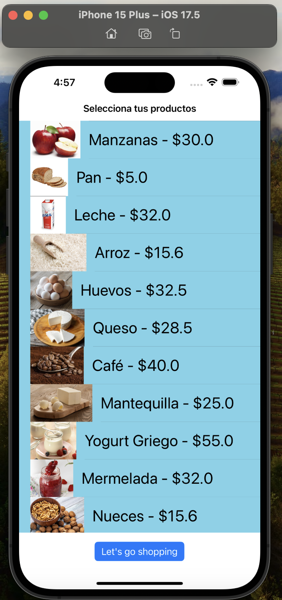
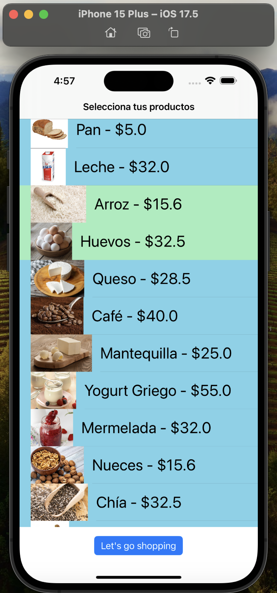
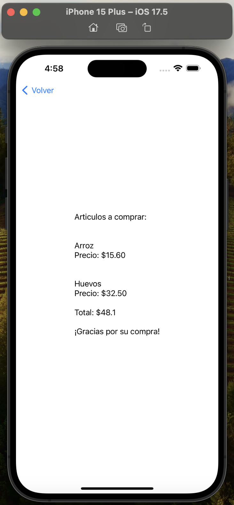
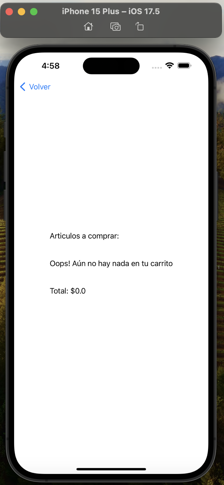

# ShoppingListApp

A simple app designed to learn how to use XIB files. The app simulates a shopping list where you can view a list of items to buy, select or unselect them, and press a button to see the total cost of your purchase.

# Implementation Details

* Views are embedded in a Navigation Controller created in the SceneDelegate file.
* The project is built using only XIB files.
* The app supports only portrait mode (landscape mode is not supported).
* The list of items is displayed using a `UITableView`.
* The `Product` struct could definitely have a better implementation, but for practicality, it is kept as a simple embedded structure.
* A segue is implemented in the `performViewChange` function, which creates a new view and pushes it into the existing Navigation Controller.
* Some parameters are passed to the new view in `performViewChange` to display the total bill on the following screen.

# Preview

1. First screen shows available items

2. You can select items by tapping them. The color will change to green

3. After pressing the button "Let's go shopping" you will be redirected to a new screen which will calculate the final amount of your purchase 

4. If no item is selected the second screen will notify it.

